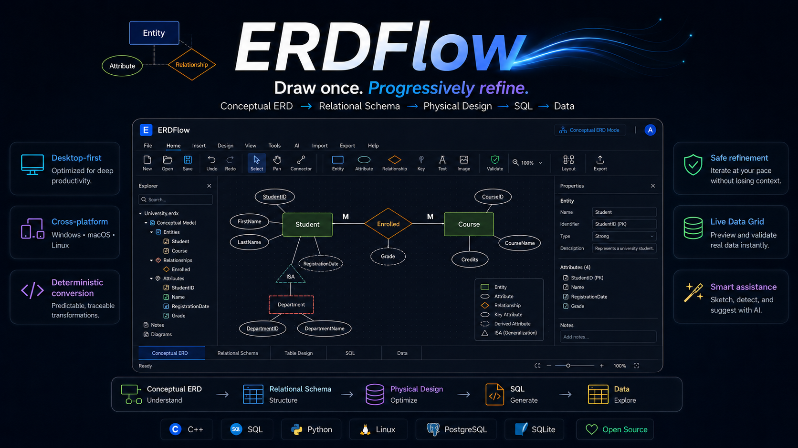
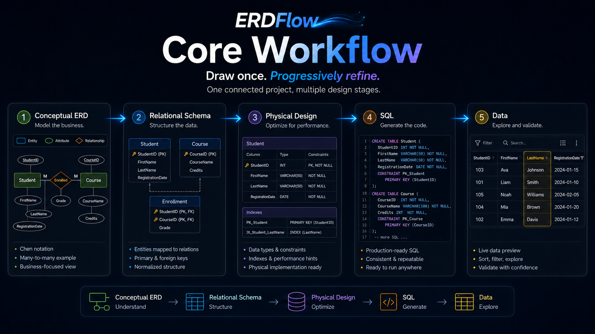
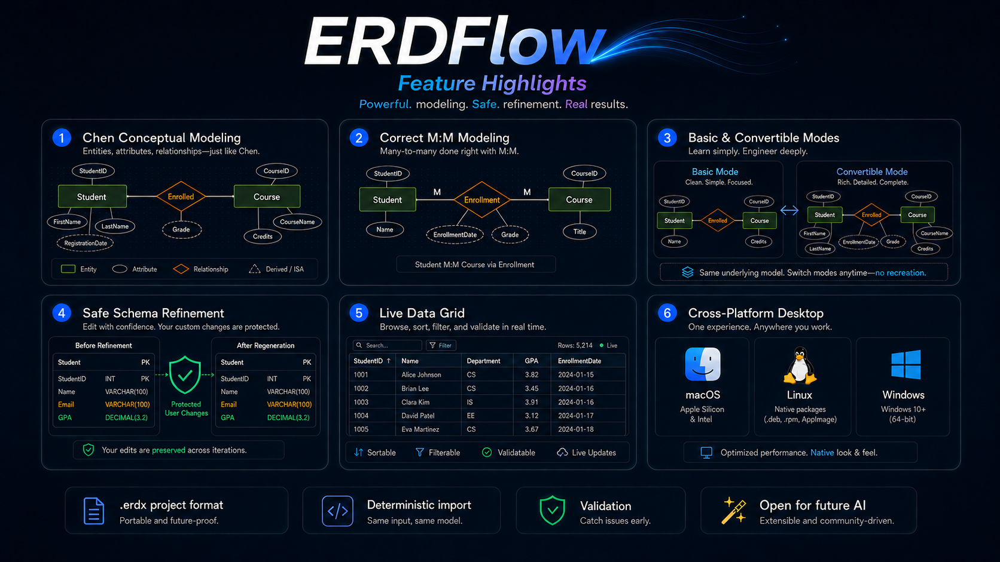
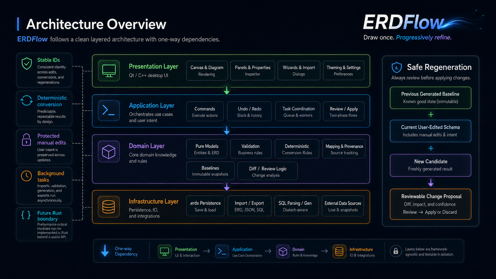

<p align="center">
  
</p>

<h1 align="center">ERDFlow</h1>

<p align="center">
  <b>Draw once. Progressively refine.</b>
</p>

<p align="center">
  A desktop-first visual database design environment for moving from
  <b>Conceptual ERD</b> → <b>Relational Schema</b> → <b>Physical Design</b> → <b>SQL</b> → <b>Data</b>.
</p>

<p align="center">
  
  
  
  
</p>

---

## Overview

**ERDFlow** is being designed as a professional, cross-platform desktop application for understanding, designing, refining, and transforming database models.

It follows one connected workflow:

- **Conceptual ERD** — understand the business
- **Relational Schema** — structure the data
- **Physical Design** — optimize implementation details
- **SQL** — generate the code
- **Data** — explore and validate data

The core idea is simple:

> **Draw once. Progressively refine.**

Instead of redrawing the same project at every stage, ERDFlow keeps the stages connected as different representations of the same project.

---

## Visual Showcase

<p align="center">
  
</p>

---

## Why ERDFlow?

ERDFlow is being built to combine:

- **Chen conceptual modeling**
- **Correct M:M modeling**
- **Basic and Convertible conceptual modes**
- **Deterministic downstream conversion**
- **Safe schema refinement**
- **Structured SQL generation**
- **Live Data Grid**
- **Cross-platform desktop experience**
- **Future-ready architecture for AI, plugins, and ecosystem integration**

---

## Feature Highlights

<p align="center">
  
</p>

### Planned core capabilities

- **Chen Conceptual Modeling**
  - entities
  - attributes
  - relationships
  - weak entities
  - associative entities
  - ISA / generalization-specialization

- **Correct relationship modeling**
  - `1:1`
  - `1:M`
  - `M:1`
  - `M:M`

- **Basic vs Convertible Modes**
  - learn with a clean conceptual view
  - switch to a richer engineering-oriented mode
  - keep the same underlying model

- **Safe downstream refinement**
  - generated models stay reviewable
  - manual edits are protected
  - regeneration is controlled

- **Live Data Grid**
  - browse
  - sort
  - filter
  - validate
  - inspect imported/project data

---

## Architecture Overview

<p align="center">
  
</p>

ERDFlow follows a clean layered architecture with one-way dependencies:

- **Presentation Layer**
  - Qt / C++ desktop UI
  - canvas
  - panels
  - dialogs
  - workspace views

- **Application Layer**
  - commands
  - undo / redo
  - task coordination
  - review / apply flows

- **Domain Layer**
  - pure domain models
  - validation
  - deterministic conversion rules
  - mapping and provenance
  - baselines
  - diff / review logic

- **Infrastructure Layer**
  - `.erdx` persistence
  - import / export
  - SQL parsing and generation
  - external data sources

### Important architectural principles

- **Stable IDs**
  - identities survive rename and refinement

- **Deterministic conversion**
  - same input should produce predictable output

- **Protected manual edits**
  - downstream user changes must not be destroyed silently

- **Background work**
  - imports, validation, generation, and export should not freeze the UI

- **Future Rust boundary**
  - performance-critical parts may later be implemented behind a stable boundary

---

## Safe Regeneration Philosophy

ERDFlow is designed around safe refinement.

Instead of replacing downstream work blindly, it will follow a review-oriented approach:

```text
Previous Generated Baseline
        +
Current User-Edited Model
        +
New Candidate
        ↓
Reviewable Change Proposal